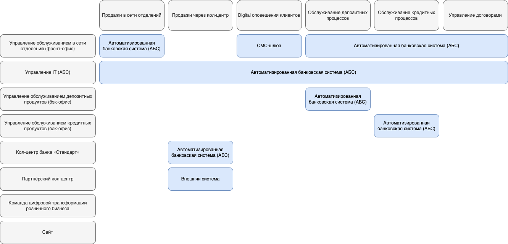
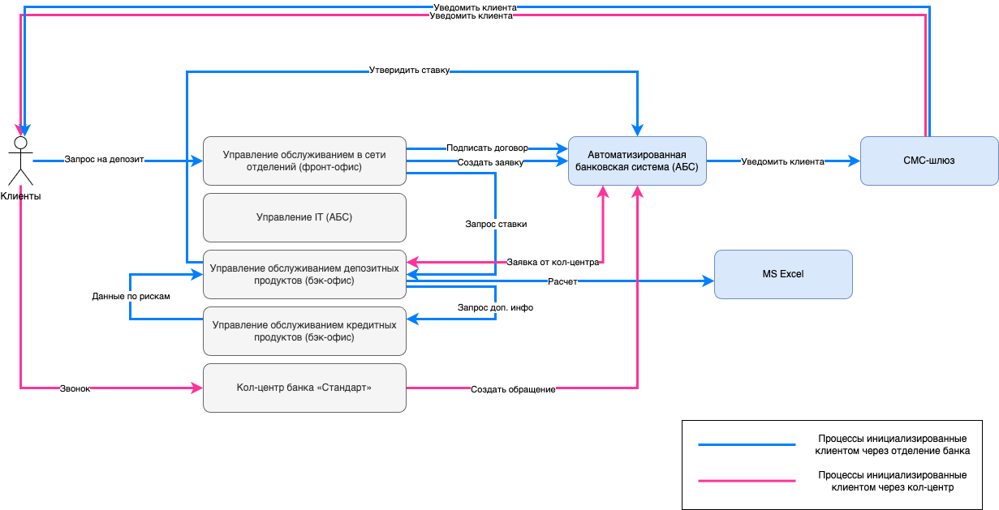

# Задание 1. Карта IT-ландшафта и схема интеграции приложений

## Карта текущего IT-ландшафта

 - [Исходник drawio](./digital_landscape.drawio)

## Схема интеграции приложений

 - [Исходник drawio](./integrations.drawio)

