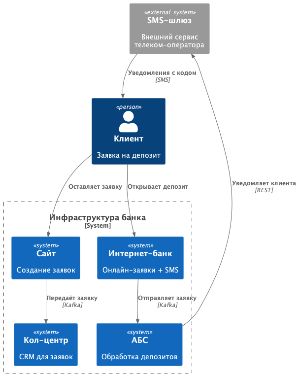
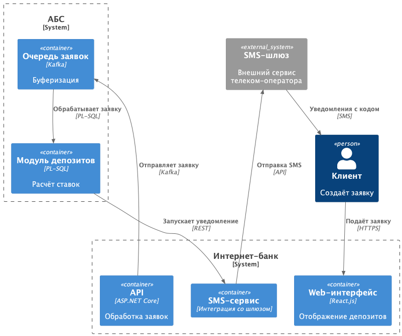

### **Название задачи: Архитектура MVP - Открытие депозитов онлайн** 
### **Автор: Дмитрий Оверченко**
### **Дата: 10 мая 2025**
### **Функциональные требования**

|**№**|**Действующие лица или системы**|**Use Case**|**Описание**|
| :-: | :- | :- | :- |
| UC1 | Клиент | Подача заявки через сайт | Клиент вводит ФИО и телефон -> заявка передаётся в кол-центр (Kafka). |
| UC2 | Клиент | Подача заявки через интернет-банк | Выбор счёта, суммы -> подтверждение SMS -> заявка в АБС (Kafka). |
| UC3 | Кол-центр | Обработка заявки с сайта | Менеджер звонит клиенту, уточняет детали -> создаёт заявку в АБС |
| UC4 | Бэк-офис (АБС) | Подтверждение ставки и открытие депозита | Проверка заявки -> расчёт ставки -> открытие депозита -> СМС-уведомление |

### **Нефункциональные требования**

|**№**|**Требование**|
| :-: | :- |
| NFR1 | Доступность 99.9% (горизонтальное масштабирование интернет-банка, резервный ЦОД) |
| NFR2 | Шифрование трафика (TLS 1.3) для передачи чувствительных/персональных данных |
| NFR3 | Время отклика интерфейса порядка 10 мс (кеширование справочников) |
| NFR4 | Использование шины данных Kafka для асинхронности |

### **Решение**

**Диаграмма контекста**

[Исходник puml](./c4_context.puml)

**Диаграмма контейнеров**

[Исходник puml](./c4_container.puml)

В ходе принятия решения прежде всего руковоствался следующими требованиями:

1. Асинхронные вызовы через Kafka — для того, чтобы избежать перегрузки АБС.
2. Изоляция депозитного модуля в АБС — для упрощения разработки и поддержки.
3. SMS-сервис как отдельный контейнер — для реализации отказоустойчивости на уровне провайдеров.  

### **Альтернативы**

 - Прямые вызовы API АБС - Риск перегрузки АБС, низкая отказоустойчивость.
 - SQL-очереди вместо Kafka - Ограниченная масштабируемость, сложность интеграции с другими системами.

**Недостатки, ограничения, риски**

- Задержки в Kafka могут привести к отложенной обработке заявок, необходима приоритизации.
- Недостаток экспертизы по Kafka у команды, необходимо обучение.