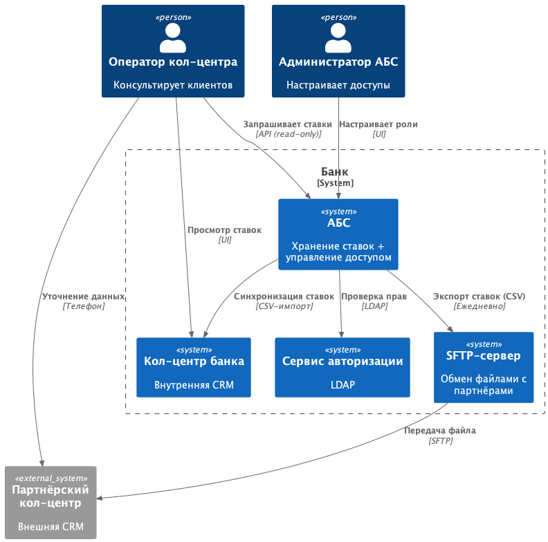
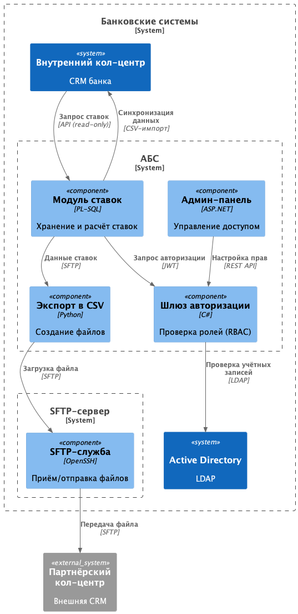
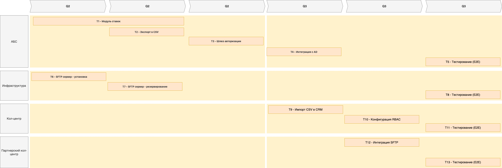

### **Название задачи: Архитектура MVP - Передача ставок в кол-центр** 
### **Автор: Дмитрий Оверченко**
### **Дата: 10 мая 2025**
### **Функциональные требования**

|**№**|**Действующие лица или системы**|**Use Case**|**Описание**|
| :-: | :- | :- | :- |
| UC1 | АБС | Экспорт актуальных ставок | Ежедневное формирование файла со ставками в формате CSV |
| UC2 | Кол-центр банка | Загрузка ставок | Импорт файла ставок из АБС в систему кол-центра (раз в сутки) |
| UC3 | Партнёрский кол-центр | Получение ставок через SFTP | Автоматическая выгрузка файла из SFTP-сервера банка |
| UC4 | Сотрудник кол-центра | Консультация по ставкам | Просмотр актуальных ставок в CRM |
| UC5 | Администратор АБС | Настройка ролевого доступа к ставкам | Разграничение прав: Бэк-офис депозитов -> редактирование ставок; Кол-центр -> только просмотр |

### **Нефункциональные требования**
Опишите здесь нефункциональные требования и архитектурно-значимые требования.

|**№**|**Требование**|
| :-: | :- |
| NFR1 | Ролевая модель (RBAC) с аудитом изменений |
| NFR2 | Интеграция с Active Directory для аутентификации |
| NFR3 | Резервирование SFTP-сервера на случай сбоя |
| NFR4 | Запрет прямого доступа к файлам ставок для партнёров (только через SFTP с шифрованием) |

### **Решение**

**Диаграмма контекста**

[Исходник puml](./c4_context.puml)

**Диаграмма контейнеров**

[Исходник puml](./c4_container.puml)

В ходе принятия решения я руководствовался прежде всего следующими принципами:

1. Автоматизация процессов: Замена ручного Excel-учёта ставок на модуль в АБС (PL-SQL) для мгновенного расчёта и исключения ошибок.
2. Консультации по ставкам: Ежедневный экспорт в CSV для кол-центра и SFTP-отправка партнёру.
3. Защита от утечек данных: Разграничение доступа (роли "оператор", "администратор").
4. Использование текущего стека технологий АБС: Оставлен PL-SQL (минимальные изменения ядра).

### **Альтернативы**

 - Прямые вызовы API АБС - Риск перегрузить систему, отказ в обслуживании.
 - Облачное хранилище не соответствует политике безопасности банка.

**Недостатки, ограничения, риски**

1. Обновление ставок: Клиенты могут получить устаревшую информацию от операторов партнерского кол-центра, что может взывать жалобы и в итоге потерю доверия. Что можно сделать - соглашение о времени изменения информации по ставкам, мониторинг времени выгрузки, автоматические уведомления при задержках.
2. Передача файлов без шифрования - может привести к утечке данных, что повлечет репутационные потери. Как можно исправить шифровать не только канал передачи данных, но и сами данные (файлы).

### Список задач для MVP

АБС:
 - Реализовать модуль экспорта ставок в CSV (Python + PL-SQL)
 - Настроить расписание выгрузки (раз в сутки)
 - Реализация шлюза авторизации (интеграция с AD)

Инфраструктура:
 - Развернуть SFTP-сервер с резервированием

Кол-центр банка:
 - Автоматизировать импорт CSV в CRM
 - Конфигурация RBAC

Партнёрский кол-центр:
 - Интеграция с SFTP банка (на стороне кол-центра)

Тестирование:
 - Интеграционное
 - Нагрузочное
 - End-to-End

### Дорожная карта

[Исходник drawio](./RoadMap_bank_Standart.drawio)

